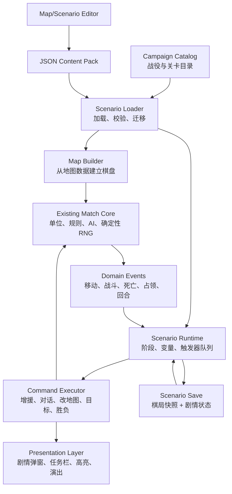

# 单人 PVE 群像传记战役基础设施与首关方案

> 方案状态：可进入技术拆分与原型阶段  
> 当前基线：教程 v2（`js/tutorialController.js`、`js/tutorialScenario.js`）  
> 首个内容包：第一部群像传记《我心如火》·序章《雨幕下的孤城》（狂战士视角）

## 1. 要解决的问题

目标不是继续扩写一个“更长的教程”，也不是为每位将领分别制作互不相干的个人传记，而是在现有对战规则上增加一层可复用的单人战役运行时。每条传记是一部由多名将领共同出演的完整故事：角色可以来自不同势力，拥有不同性格、立场和经历；玩家的扮演身份、控制阵营甚至叙事视角都可以随关卡或章节转换。以现代战争故事线为例，空军上校、天眼和工程师可以分别承担空中指挥、战场侦察和阵地建设等角色，在同一场战争中交错推进各自的经历。基础设施需要支持：

- 局前简报、局内对话、地图演出和战后结算；
- 多角色阵容、人物关系、跨阵营同台演出和多线叙事汇合；
- 在同一条传记中按关卡切换玩家所扮演的角色、势力与控制阵营；
- 固定流程、条件分支、伏兵、增援、撤退、阶段转换和脚本 AI；
- 占领、坚守、护送、歼灭指定目标、限时到达等组合胜负条件；
- 主目标、可选目标、失败条件和实时任务追踪；
- 固定地图、固定单位、固定手牌、固定天气与可复现随机种子；
- 关卡解锁、星级/勋章、最佳成绩、断点续玩和版本迁移；
- 由策划直接修改地图和关卡数据，而不必在业务逻辑里写坐标特判。

本期不应把联机权威同步、UGC 创意工坊、完整过场动画系统纳入首个 MVP。战役首先是本地单人能力；脚本与关卡数据要保持可校验、可版本化，为未来扩展留接口。

## 2. 现状审计

### 2.1 可复用资产

- `engine/matchState.js` 已拥有可序列化的棋局状态、确定性随机数和快照恢复能力，可作为战役存档的底座。
- `js/eventBus.js` 已解耦少量规则事件和表现事件，现有教程监听了选中单位、使用卡牌、移动、使用将领技能、占城等事件。
- `engine/HexTile.js`、`js/Unit.js`、`rules/` 已形成地图格、单位与规则数据的基本边界。
- `js/ai.js` 已有普通 PVE AI，可保留为 `standard` 行为；剧情关卡只需要在其外部增加脚本调度与有限覆盖。
- 当前教程已验证遮罩挖洞、高亮目标、输入限制和固定残局部署的表现可行性。

### 2.2 当前结构的主要债务

- 教程状态只有 `tutorialMode/tutorialStep/tutorialTargets`，步骤、文案、校验和 UI 计算耦合在单个控制器内，不能表达并行目标、分支和恢复。
- 教程地图先调用 `initMap()` 随机生成标准地图，再用坐标逐格改写；新增关卡容易漏清单位、地形、城市或阵营缓存。
- `gameLogic.js` 和 `input.js` 直接判断 `tutorialMode`，规则层知道具体教程，后续每种战役都继续特判会形成不可维护的分支网。
- 胜利检测只覆盖常规歼灭/行政区与回合限制，教程通过跳过常规胜利 UI 绕开结算，缺少统一的“任务裁决优先级”。
- 事件总线的领域事件不完整，缺少攻击结算、单位死亡、回合阶段、招募、资金变化、天气变化、区域进入等稳定事件。
- 当前教程 AI 实际为“单位待命”，无法表达按阶段行动、目标优先级、撤退或增援。
- 剧情进度与棋局快照尚未作为同一个版本化存档恢复。

结论：保留教程的 UI 技术和现有规则内核，但不要以 `tutorialController.js` 为母版继续复制。应让教程成为第一份标准战役内容数据，并在迁移稳定后移除规则层的教程特判。

## 3. 目标架构



建议增加以下目录：

```text
campaign/
  catalog.js                       # 故事线/章节/关卡目录与解锁关系
  schema/                          # 数据版本、运行时校验和迁移
  runtime/
    scenarioRuntime.js             # 生命周期、阶段、变量、队列
    conditionEvaluator.js          # 无副作用条件求值
    commandExecutor.js             # 白名单指令执行
    objectiveManager.js            # 主/可选/失败目标
    scenarioSave.js                # 剧情状态与棋局快照组合存档
    scriptedAi.js                  # 剧情 AI 计划和普通 AI 的桥
  presentation/
    dialogueController.js
    objectiveHud.js
    scenarioResultController.js
    focusController.js             # 复用教程挖洞、高亮与镜头定位
  content/
    story-arc-id/
      campaign.json
      prologue-rain-city/
        scenario.json
        map.json
        dialogue.zh-CN.json
        ai.json
editor/
  mapEditorController.js
  scenarioInspector.js
  validators/
```

所有内容文件都带 `schemaVersion`。运行时只接受白名单条件与白名单指令，不执行关卡 JSON 中的 JavaScript 字符串或 `eval`，以保证存档、测试和未来 UGC 的安全性。

## 4. 数据模型

### 4.1 故事线与角色阵容目录

每条传记对应一个完整故事线，而不是绑定一名将领。故事线由章节和关卡组成，并显式声明主要角色阵容、人物关系和各关卡的叙事视角。一个角色可以在某关作为玩家主角、在另一关作为友军或对手；同一关也可以让多名角色同台，但首期建议每关只设一个主要玩家视角，以保持任务表达清晰。目录数据只描述元信息、角色阵容与解锁关系，不包含局内脚本。

```json
{
  "schemaVersion": 1,
  "id": "modern-war-chronicle",
  "titleKey": "campaign.modernWar.title",
  "cast": [
    { "characterId": "colonel", "commanderId": "colonel", "role": "protagonist" },
    { "characterId": "tianyan", "commanderId": "tianyan", "role": "protagonist" },
    { "characterId": "engineer", "commanderId": "engineer", "role": "protagonist" }
  ],
  "relationships": [
    { "from": "colonel", "to": "tianyan", "initial": "allies" },
    { "from": "tianyan", "to": "engineer", "initial": "strangers" }
  ],
  "chapters": [
    {
      "id": "chapter-1",
      "scenarioIds": ["colonel-opening", "tianyan-recon", "engineer-siege"]
    }
  ]
}
```

`characterId` 表示故事中的人物身份，`commanderId` 表示其战斗规则模板；两者不要混为同一个概念。这样同一将领模板未来可以拥有不同年龄、阵营、称号或剧情状态，而不必复制战斗规则。

每个关卡还应声明 `viewpointCharacterId`、`playableCamp` 和 `controllableCharacterIds`。前者决定对白、简报与战后叙述从谁的角度展开，后两者决定玩家实际控制哪一方和哪些关键角色。章节切换玩家身份不改变玩家的永久档案归属。

进度以 `profileId + storyArcId + scenarioId` 为键，记录 `unlocked/completed/bestRating/bestTurns/optionalObjectives`。内容解锁不能写入棋局快照；棋局快照只负责“继续战斗”。多线叙事汇合时，解锁条件可以引用同一故事线中多个前置关卡的完成状态，但不要让玩家为了推进主线而必须重复刷三星。

### 4.2 地图文件

首期支持有限半径六边形地图，并为将来不规则地图保留 `disabledTiles`。地图必须完全描述棋盘，不能依赖先生成随机地图再覆盖。

```json
{
  "schemaVersion": 1,
  "id": "rain-city-map",
  "geometry": { "type": "hexRadius", "radius": 7 },
  "tiles": [
    { "q": -1, "r": 0, "terrain": "forest", "districtId": 5, "camp": "neutral" },
    { "q": 0, "r": 0, "terrain": "plains", "districtId": 5, "camp": "player2", "city": { "id": "central-city" } }
  ],
  "units": [
    { "id": "hero", "type": "cavalry", "camp": "player1", "q": -2, "r": 0, "commanderId": "berserker", "hpPct": 0.78 },
    { "id": "gate-centurion", "type": "infantry", "camp": "player2", "q": 0, "r": 0, "commanderId": "centurion", "hpPct": 0.15 }
  ],
  "zones": {
    "central-city-zone": [{ "q": 0, "r": 0 }],
    "east-road": [{ "q": 1, "r": -1 }, { "q": 2, "r": -1 }]
  }
}
```

建议同时给单位、城市、区域定义稳定字符串 ID。脚本引用 `hero` 或 `central-city`，不直接引用瞬时对象，也尽量不重复写坐标。

### 4.3 关卡文件

关卡是“配置 + 阶段图 + 目标 + 触发器”的集合：

- `setup`：阵营、玩家控制方、当前视角角色、可控角色、将领、天气、金币、手牌、牌堆、迷雾、随机种子、允许操作；
- `variables`：只存 JSON 基本类型，是分支与一次性标记的数据源；
- `phases`：当前剧情阶段；一个阶段可有进入/退出指令；
- `triggers`：事件触发或状态触发，包含条件、指令和是否只执行一次；
- `objectives`：展示文本、完成条件、失败条件、隐藏条件和评分权重；
- `resultRules`：胜负判定与结算评级；
- `checkpoints`：允许存档的安全节点。

脚本运行时不应只有一根线性步骤指针。采用“当前阶段 + 多个目标 + 触发器集合 + 变量”的模型，既能实现严格教程，也能实现自由战斗中的条件剧情。

### 4.4 条件 DSL

首期条件保持小而明确，支持 `all/any/not` 组合：

- 事件条件：`event.type`、事件载荷中的 `unitId/camp/cardId/cityId`；
- 状态条件：回合数、当前阵营、阶段、变量值、单位存活/血量/位置、城市归属；
- 统计条件：指定阵营单位数、区域内单位数、击杀数、控制城市数、资金；
- 目标条件：某目标已完成/失败。

示例：狂战士已进入森林且仍存活。

```json
{
  "all": [
    { "unitAlive": "hero" },
    { "unitInZone": { "unitId": "hero", "zoneId": "forest-approach" } }
  ]
}
```

条件求值必须无副作用。每次领域事件后求值一次，回合边界再全量求值一次，避免每帧扫描造成重复触发。

### 4.5 指令 DSL

首期白名单指令建议包括：

- 剧情：`showDialogue`、`showBanner`、`showToast`、`playMusic`、`playSound`；
- 镜头：`focusTile`、`focusUnit`、`highlight`、`setInputPolicy`；
- 棋盘：`spawnUnit`、`removeUnit`、`moveUnit`、`setUnitState`、`setTile`、`setCityOwner`；
- 资源：`grantGold`、`setHand`、`giveCard`、`setWeather`；
- 任务：`revealObjective`、`completeObjective`、`failObjective`；
- 流程：`setVariable`、`changePhase`、`createCheckpoint`、`startAiPlan`；
- 结算：`winScenario`、`loseScenario`。

所有改变棋局的指令通过现有规则 API 或专门的场景变更服务执行，不应直接在 UI 控制器中改 `gameState`。指令执行采用串行队列；对话、镜头移动和动画可以返回 Promise，后续命令等待其完成，从而保证演出顺序稳定。

## 5. 运行时关键机制

### 5.1 生命周期

统一入口建议为 `startScenario(scenarioId, options)`：

1. 加载并校验战役目录、关卡、地图、对白与 AI 数据；
2. 重置普通棋局状态，设置 `gameMode = 'campaign'` 和确定性种子；
3. 由 `MapBuilder` 创建完整棋盘、单位、手牌、天气和缓存；
4. 创建 `ScenarioRuntimeState`，注册领域事件监听；
5. 执行 `onScenarioStart` 与首阶段 `onEnter` 指令；
6. 解锁输入，进入正常规则循环；
7. 每个领域事件按“记录事件 → 推进目标 → 执行触发器 → 裁决胜负 → 刷新 UI”处理；
8. 结算后写入战役进度，清理监听和临时输入限制。

`ScenarioRuntimeState` 至少包含：

```text
scenarioId, contentVersion, phaseId, variables,
triggerStates, objectiveStates, scriptedAiState,
pendingCommands, checkpointId, completed, result
```

### 5.2 领域事件补齐

在不改变规则结果的前提下，补齐以下稳定事件：

- `match:started`
- `turn:started` / `turn:ended` / `round:started`
- `unit:selected` / `unit:moved`
- `combat:started` / `combat:resolved`
- `unit:damaged` / `unit:healed` / `unit:killed`
- `city:captured`
- `card:used`
- `commander:skillUsed`
- `unit:recruited`
- `weather:changed`

事件载荷使用稳定 ID 和结算前后数值，不让内容脚本依赖 DOM、Canvas 坐标或 `Unit` 对象引用。旧事件名可先桥接，完成迁移后再删除。

### 5.3 输入策略

用通用 `InputPolicy` 取代散落的 `tutorialMode` 判断。策略可以是：

- `free`：完全自由；
- `blocked`：演出期间禁止棋盘操作，但保留设置、刷新保护等系统键；
- `allowActions`：只允许一组动作类型；
- `allowTargets`：只允许指定单位、格子、卡牌或技能；
- `confirmForbiddenAction`：不吞掉点击，给出数据化提示。

规则层只询问 `scenarioRuntime.canPerform(actionContext)`，不知道当前是教程第几步。这样严格引导和普通剧情关都使用同一接口。

### 5.4 胜负裁决

战役模式下由 `ObjectiveManager` 先裁决，常规对战胜利检测降为可选条件提供者。建议优先级：

1. 已经结算则不再处理；
2. 强制失败条件（关键将领死亡、护送目标死亡、超时）；
3. 强制胜利条件；
4. 当前阶段转换；
5. 常规歼灭/领土胜利（仅关卡显式启用）；
6. 无结果则继续。

同一事件同时触发胜利和失败时，默认失败优先；关卡可声明特殊优先级。结算不能依赖 `setTimeout` 猜动画时长，应进入 `resolving` 状态，等待命令/动画队列完成后展示结果。

目标类型不要写死为一组巨大枚举；用条件 DSL 表达完成与失败。UI 层只关心目标状态：`hidden/active/completed/failed`。

### 5.5 剧情 AI

采用三层能力，避免为每关复制一份 AI：

1. `disabled/hold`：不行动或固守；
2. `scriptedPlan`：按顺序执行“移动到区域、攻击指定目标、撤退、待命、使用技能”等命令，命令失败时有 fallback；
3. `standard`：调用现有 PVE AI，并用 `priorities/forbiddenZones/protectedUnitIds` 做轻量修正。

脚本 AI 必须走与玩家相同的合法性和战斗规则，只在明确的剧情指令（例如无动画增援、强制撤离）中使用场景变更服务。每个 AI 计划要能序列化当前位置，支持中途存档恢复。

### 5.6 对话与演出

需要两种局内文本容器：

- `modal`：重大剧情/教学，暂停脚本队列并阻断局内输入；支持头像、姓名、阵营色、左右站位、逐字显示、继续/跳过、历史回看；
- `radio`：战斗中短句，不阻断操作或仅短暂停顿；适合增援提醒和敌将喊话。

对话数据与逻辑分离，`dialogue.zh-CN.json` 以台词 ID 存文案。首期不做玩家选择分支，但数据结构预留 `choices`；只有选择确实影响变量时才启用，避免无意义选择。

必须提供“跳过已读剧情”“自动播放”“文字速度”和“对话历史”。跳过只跳表现等待，不跳过其后必要的棋局指令。

### 5.7 存档、重试与版本

分为三类数据：

- `campaignProgress`：永久解锁和最佳成绩；
- `scenarioResume`：棋局快照 + 运行时状态 + 内容版本；
- `settings`：对话速度、是否自动播放等本地偏好。

仅在安全节点自动存档：关卡开始、阶段切换完成、玩家回合开始且命令队列为空。演出中、AI 行动中、战斗动画未结算时不存档。

关卡重试必须使用同一个场景种子并重建地图；“从检查点重试”恢复组合快照。若 `contentVersion` 不兼容，则明确提示该继续存档已失效，但不删除永久进度。

## 6. 地图与关卡编辑工具

### 6.1 实施策略

不要第一步就做独立大型编辑器。先在现有 Canvas 上做仅开发环境可见的“地图编辑模式”，复用真实渲染和六边形命中检测；待数据格式稳定后再补剧情时间线/触发器面板。

#### 地图编辑器 MVP

- 新建有限半径地图或从现有关卡载入；
- 画笔：地形、阵营、行政区、城市、村庄、工事；
- 单位放置：兵种、阵营、将领、HP、士气、是否已行动、稳定 ID；
- 区域工具：框选/逐格选择并命名 zone；
- 橡皮、撤销/重做、复制/粘贴、镜像/旋转（后两项可稍后）；
- 实时显示 `q,r`、district、zone、单位 ID；
- JSON 导入/导出、格式化、schema 校验；
- 一键“从此地图试玩”，退出后回到编辑状态。

#### 场景检查器 MVP

- 选择当前 phase，查看目标与 trigger 列表；
- 手动触发某条 trigger，查看命令执行日志；
- 修改变量、跳转阶段、模拟回合开始/单位死亡等事件；
- 展示未解析的单位/城市/区域 ID；
- 显示触发器为何未触发的条件求值结果。

可视化节点式剧情编辑器暂缓。首批关卡由 JSON + 校验器维护会更快，也能先验证 DSL 是否稳定；节点编辑器应建立在已经经历至少 3 个不同关卡验证的数据模型上。

### 6.2 必须具备的静态校验

- 坐标合法且不重复，单位不能叠放；
- 每个单位、城市、区域、目标、触发器 ID 唯一；
- 所有脚本引用都能解析；
- 阵营、兵种、将领、地形、卡牌来自现有规则定义；
- 城市拥有合法行政区，行政区至少有一个有效格；
- 阶段可达，不存在无出口的必经阶段（显式最终阶段除外）；
- `once` 触发器不会形成循环，非 `once` 触发器有冷却或清晰的边沿触发语义；
- 至少一个胜利路径和所有关键失败条件可解析；
- 对话 key 存在；
- 地图初始状态不会在关卡开始后立即意外触发常规胜负。

## 7. 首个战役：《我心如火》·序章《雨幕下的孤城》（狂战士视角）

### 7.1 定位

这是改编后的正式教程，也是第一条群像传记的入口关。当前关卡以狂战士为玩家视角，但不把整条故事线定义为“狂战士个人传”；百夫长、弩手及后续登场的其他将领都可以拥有独立动机，并在未来关卡中成为玩家视角、盟友或对手。时长目标 8–12 分钟。前 60% 是强引导，后 40% 放开有限决策，用一次敌军反扑把“照着点完”升级为真正的微型关卡。

它不承担解释所有规则的任务。首关只教授：

1. 战场信息与天气；
2. 选中单位和查看兵种/将领能力；
3. 使用一张对策卡；
4. 移动与地形；
5. 主动技能；
6. 攻击、占领和阶段目标；
7. 结束回合与守住城市。

招募、抽牌、工事、迷雾、双将领和复杂士气留给后续关卡，避免首关认知过载。

### 7.2 剧情梗概

狂战士尚未成名时，所在的先遣队在雨夜被百夫长的守军截断退路。中央孤城控制着唯一可供大军通过的石桥。主力将在黎明前撤至此处；若孤城仍在敌军手中，伤兵和辎重将被追兵吞没。

军医用最后一份药剂为狂战士包扎，他带着山坡上的弩手穿过林地突袭城门。百夫长败退前发出信号，东路骑兵随即反扑。玩家必须让狂战士活下来并守住刚夺下的城市，直到友军抵达。战后，士兵第一次以“狂战士”称呼他，为该角色确立人物母题：力量来自伤痛，但他要学习为何而战，而不只是如何杀敌。后续关卡可以切换到百夫长或其他角色的视角，重新解释这场攻防战的前因与后果，使本关成为群像故事中的一个切面，而不是唯一真相。

这是一段经过戏剧化处理的虚构群像传记，不暗示现实历史人物。未来若引入真实历史将领，应在故事线页面标明史实、演义和纯虚构内容的边界。

### 7.3 初始局面

- 天气固定为雨；红军为玩家，蓝军为敌军，中立势力不行动；
- 玩家：受伤的狂战士骑兵、位于山地且本回合已行动的弩手；
- 敌军：中央城市内的残血百夫长、东路一支暂未登场/隐藏的骑兵；
- 玩家初始持有 1 张剧情版“疗愈”，资金固定，不允许抽牌和招募；
- 狂战士、弩手、中央城市和东路区域都有稳定 ID；
- 地图使用当前教程中央区域的构图，但改为完整固定地图文件，不再依赖随机地形结果。

### 7.4 目标

主目标按阶段切换：

1. **突破城门**：狂战士进入指定森林，再击败百夫长并占领中央城市；
2. **守到援军抵达**：在下一次玩家回合结束时仍控制中央城市；
3. **保住主将**：狂战士必须存活（常驻失败条件）。

可选目标：

- **无人掉队**：弩手存活；
- **雷霆反击**：在第 3 回合结束前消灭反扑骑兵。

失败条件：

- 狂战士阵亡；
- 进入守城阶段后中央城市被敌军夺回；
- 超过关卡回合上限仍未完成守城。

评级建议：完成主目标为 1 星；完成一个可选目标为 2 星；两个可选目标均完成为 3 星。首通解锁下一关不要求三星。

### 7.5 分阶段脚本

| 阶段 | 触发 | 演出与教学 | 输入策略 | 退出条件 |
| --- | --- | --- | --- | --- |
| `briefing` | 关卡开始 | 雨夜简报，百夫长封桥，说明总目标 | 全阻断 | 对话结束 |
| `inspect` | 简报结束 | 聚焦天气、狂战士、弩手，说明兵种与血怒 | 仅允许查看指定目标 | 查看完成 |
| `field_aid` | 查看狂战士 | 军医对白，发放/强调疗愈卡 | 仅允许疗愈卡与狂战士目标 | 疗愈成功 |
| `approach` | 疗愈成功 | 标记森林，说明雨天与地形移动成本 | 仅允许狂战士移动到目标格 | 进入森林 |
| `assault` | 进入森林 | 狂战士与百夫长交锋对白，教学泣血与攻击 | 仅允许泣血、攻击百夫长 | 城市被玩家占领 |
| `counterattack` | 城市易手 | 镜头移到东路，生成骑兵并更新目标；教学结束回合 | 有限自由：玩家单位正常行动，禁招募/抽牌 | 反扑 AI 回合完成 |
| `hold` | 玩家再次获得行动权 | 援军倒计时，允许玩家歼敌或固守 | 同上 | 玩家结束回合且仍控制城市 |
| `victory` | 守城成功 | 援军旗帜/对白、正式称号、战后结算 | 全阻断 | 返回战役页 |

关键设计：夺城不立即胜利。占城事件只完成第一目标、切换阶段并生成反扑；这样首关真实验证“阶段变化后目标重写”和“延迟胜利”。

### 7.6 敌军脚本

- 百夫长在 `assault` 前固定固守，不主动行动；为了教学稳定，初始生命值按预期伤害倒推，而不是写“必杀”作弊。
- 东路骑兵在 `counterattack` 开始时生成，播放 `radio` 喊话并聚焦 1 秒；其 AI 计划为：优先攻击占城的狂战士，若无法攻击则向中央城市移动。
- 如果狂战士因实际移动位置导致标准路径不可达，fallback 为移动到离中央城市最近的合法格；仍失败则待命并记录诊断日志，不能卡死回合。
- 弩手在放权阶段可由玩家使用，形成一个简单但真实的选择：远程击杀反扑骑兵，或留在高地保证安全。

### 7.7 对话节奏与示例

对话应短句化，一屏最多 2–3 句。机制解释放任务提示，人物对白负责动机，不要让角色朗读规则说明。

- 军医：“这是最后一份药。桥后还有三十个走不动的人——你若倒下，他们也走不掉。”
- 狂战士：“把绷带系紧。城门归我。”
- 百夫长：“雨会拖住你的马，也会洗掉你留下的血。”
- 狂战士：“那就趁它还没洗净，记住我。”
- 反扑骑兵：“信号已起！夺回石桥！”
- 弩手（胜利后）：“他们问该怎么称呼你。”
- 狂战士：“先让活着的人过桥。名字，等天亮再说。”

对白仅为首轮编剧方向，进入制作前应结合世界观、将领立绘和后续章节统一修订。

### 7.8 首关刻意验证的基础设施

- `modal` 与 `radio` 两种对话；
- 事件驱动阶段转换；
- 严格输入限制切换到有限自由；
- 使用卡牌、移动、技能、战斗、占城、回合等领域事件；
- 阶段性主目标、常驻失败条件和可选目标；
- 当前玩家视角、可控阵营与角色身份的场景级配置；
- 动态增援和脚本 AI；
- 特殊胜利条件覆盖常规占城胜利；
- 自动检查点、重试、战后评级与解锁；
- 固定地图文件和编辑器试玩闭环。

如果首关只能靠专用 JavaScript 回调完成，说明 DSL 设计仍不够通用；但也不应为了避免一个合理的新指令而把 DSL 做成通用编程语言。

## 8. 分期实施计划

以下以 1 名熟悉项目的开发者为估算基准，包含基础自动化测试，不包含新立绘、配音和大规模音乐制作。

### Phase 0：契约与测试基线（2–3 天）

- 固化场景、地图、对白、AI 和存档的 schema v1；
- 为当前教程录制关键流程断言，补充普通 PVE 回归基线；
- 定义领域事件载荷与事件顺序；
- 建立关卡 validator 的最小测试夹具。

出口：示例关卡文件可通过校验；现有教程和普通 PVE 行为未改变。

### Phase 1：地图数据化与加载器（4–6 天）

- 实现 `MapBuilder`，从固定地图建立 tileMap、单位和边界缓存；
- 从现教程提取首关 `map.json`；
- 实现稳定实体 ID 查询；
- 增加 JSON schema 校验、引用校验与错误定位；
- 支持从地图文件一键启动无剧情试玩。

出口：不调用随机 `initMap()` 也能完整建立首关棋盘，重启结果一致。

### Phase 2：通用场景运行时（6–9 天）

- 增加 `scenario` 匹配状态和组合序列化；
- 实现条件求值、串行指令队列、阶段和一次性 trigger；
- 补齐领域事件并桥接旧教程事件；
- 实现目标管理和战役胜负裁决；
- 实现通用 `InputPolicy`，逐步替换教程特判。

出口：使用纯数据完成“移动到格子 → 占城 → 生成敌军 → 守一回合 → 胜利”。

### Phase 3：剧情与任务 UI（4–6 天）

- 制作对话弹窗、战斗电台、对话历史和跳过已读；
- 制作局内任务追踪、目标状态动画和失败提示；
- 抽取教程的挖洞、高亮、目标环为 `focusController`；
- 制作战役专用结算页，展示星级、回合、可选目标和重试。

出口：首关可从头到尾游玩，表现层无教程专用判断。

### Phase 4：脚本 AI、存档与战役页（5–7 天）

- 实现 `hold/scriptedPlan/standard` 三类 AI；
- 实现安全节点自动存档、继续、整关重试和检查点重试；
- 实现战役目录、解锁与最佳成绩；
- 完成首关反扑 AI、评级和首通解锁。

出口：刷新页面后可从安全节点继续；首关完成后正确记录进度。

### Phase 5：地图编辑器 MVP（6–10 天）

- 加入开发模式入口、地形/阵营/行政区/城市/单位/区域画笔；
- 实现撤销重做、导入导出、实时校验和一键试玩；
- 实现场景检查器的阶段、变量、事件模拟和条件诊断。

出口：不改源码即可调整首关地图、单位、区域并导出通过校验的数据。

### Phase 6：打磨与内容生产门槛（4–6 天）

- 完成首关文案、数值、移动端与键鼠体验；
- 增加无障碍焦点、快速跳过、防误触和对话历史；
- 做 3 次完整可玩性走查：首次玩家、熟练玩家、异常操作；
- 用第二个概念关卡验证 DSL：建议做“护送目标到撤离区”，但不必上线完整美术。

出口：第二种目标结构无需改运行时核心，证明基础设施不是只为首关定制。

总估算约 31–47 个开发日。若先只交付首关可玩 MVP，可在完成 Phase 0–4 后上线本地版本，约 21–31 个开发日；编辑器随后补齐。

## 9. 测试与验收

### 9.1 自动化测试

- 条件求值器：每种原子条件、嵌套 `all/any/not`、边界值；
- 命令执行器：顺序、异步等待、失败回滚/停止、幂等 once；
- validator：重复 ID、丢失引用、非法坐标、不可达阶段和循环触发；
- MapBuilder：同数据生成同快照，实体/区域解析正确；
- 存档：阶段、目标、触发器、AI 计划和 RNG 恢复一致；
- 胜负：同事件冲突、失败优先、常规胜利关闭/开启；
- 首关 headless 流程：合法路线通关、狂战士死亡失败、丢城失败、超时失败；
- 普通本地/PVE/联机回归：场景运行时未激活时行为不变。

### 9.2 首关人工验收

- 所有非目标点击给出明确提示，不出现“点击没反应”；
- F5、F12、设置、音量等系统操作不被输入遮罩误伤；
- 对话快速连续点击不会重复触发命令或跳过两句；
- 动画尚未完成时不能抢操作；
- 夺城后不提前出现普通胜利面板；
- 反扑骑兵无论路径是否被占都能结束回合；
- 刷新后从安全节点继续不会重复生成敌军或重复对白；
- 重试后天气、手牌、伤量和 AI 行为可复现；
- 1366×768、1920×1080 和常见移动端尺寸下，对话与任务栏不遮住强制目标；
- 跳过剧情后仍执行目标揭示、增援和阶段切换；
- 完成三星条件、仅主目标、失败重试三条路径结算正确。

## 10. 风险与控制

- **事件遗漏**：关卡会逼迫 UI 轮询状态。控制方式是先定义领域事件合同，并用回合边界全量求值兜底。
- **指令 DSL 膨胀**：每关都要求新指令。控制方式是优先组合稳定原子指令，并用第二个不同类型原型关验证。
- **规则与脚本竞态**：占城同时触发普通胜利和剧情增援。控制方式是战役裁决先于普通胜利，所有触发器走串行队列。
- **存档重复副作用**：恢复后再次发兵/发卡。控制方式是持久化 trigger 执行状态与命令序号，所有一次性指令具备幂等键。
- **编辑器拖慢核心开发**：过早追求节点编辑器。控制方式是先完成 JSON + 校验 + 地图画笔 + 场景检查器。
- **教程信息过载**：首关同时讲太多系统。控制方式是严格限制七个学习点，高阶系统分散到后续群像关卡。
- **角色身份与战斗模板耦合**：切换年龄、阵营或视角时被迫复制将领规则。控制方式是分离 `characterId` 与 `commanderId`，关卡单独声明玩家视角和控制权。
- **剧情 AI 卡死**：目标被占、路径变化或单位提前死亡。控制方式是每条计划定义 fallback、超时和安全待命。
- **内容更新破坏继续存档**：控制方式是 schema/content 双版本、显式迁移和失效提示，永久进度独立保存。

## 11. 推荐的第一批开发任务

按依赖顺序创建以下任务即可开始：

1. 定义并提交 schema v1、示例首关数据与 validator；
2. 实现固定地图 `MapBuilder`，迁移当前教程残局部署；
3. 为移动、战斗、死亡、占城、卡牌、技能和回合补齐稳定领域事件；
4. 实现 `ScenarioRuntime`、条件、指令队列和阶段；
5. 实现 `ObjectiveManager` 与战役胜负优先级；
6. 实现 `InputPolicy`，迁移现教程的严格点击限制；
7. 抽取并升级剧情对话、聚焦/挖洞和任务 HUD；
8. 完成首关的夺城后反扑、脚本 AI 和结算；
9. 实现组合存档与战役进度；
10. 最后制作地图编辑器 MVP，并用第二个护送原型验收通用性。

首个里程碑不以“代码模块全部建好”为完成标准，而以这条竖切为准：**从战役页进入《雨幕下的孤城》→ 完成强引导 → 夺城触发反扑 → 自由守城 → 特殊胜利结算 → 记录星级 → 可重试/继续**。
